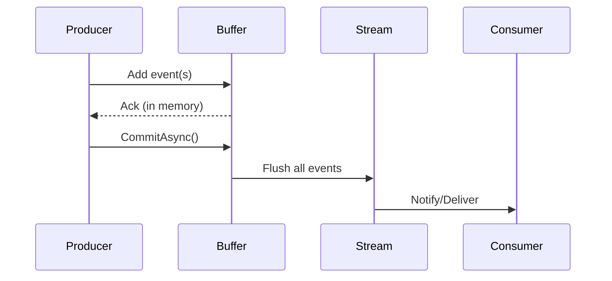

# 🎉 EventStreaming

[](https://github.com/markcastle/eventstreaming/actions)
[](https://coveralls.io/github/markcastle/eventstreaming)
[](https://www.nuget.org/packages/EventStreaming)
[](./LICENCE)
[](https://dotnet.microsoft.com/)

EventStreaming is a robust, high-performance .NET library for event sequencing, streaming, and domain event modeling. Built for reliability, concurrency, and extensibility—perfect for games, simulations, distributed systems, and more!

## What is EventStreaming for?

EventStreaming is designed to provide a flexible, lock-free, and highly concurrent event sequencing and streaming foundation for .NET applications. It is used for:

- 🎮 **Game development:** Deterministic event replay, rollback, and simulation in multiplayer and real-time games (Unity, Godot, custom engines)
- 🧪 **Simulations:** Physics, robotics, and digital twin systems requiring precise event order and replay
- 🌐 **Distributed systems:** Event sourcing, CQRS, and distributed messaging where event order and atomicity matter
- 📡 **IoT and telemetry:** High-throughput event ingestion and processing
- 📊 **Data pipelines:** Stream processing, analytics, and time-series event modeling
- 🧩 **Testing:** Generating reproducible event streams for scenario-based and property-based testing
- 🛡️ **Any scenario** where you need robust, thread-safe, and immutable event handling with support for custom domain events and serialization

**⚡ Coupling with Queuing/Buffering Systems:**

EventStreaming can be integrated with queuing or buffering systems (such as message queues, ring buffers, or concurrent queues) to enable advanced event handling and delivery patterns:

- 🌀 **Buffering:** Use a concurrent queue or ring buffer to temporarily store events before processing. This is ideal for bursty workloads or when consumer processing is decoupled from event production.
- 📬 **Queuing:** Couple EventStreaming with systems like RabbitMQ, Azure Service Bus, or in-memory queues to distribute events across processes or services, enabling scalable and reliable event-driven architectures.
- ⏪ **Replay/Gap Detection:** Buffer events for replay, out-of-order delivery, or gap detection—useful for distributed or networked systems where events may arrive late or out of sequence.
- 🚦 **Backpressure:** Integrate with buffering mechanisms to apply backpressure and control flow, ensuring that slow consumers do not overwhelm the system.

By combining EventStreaming’s sequencing and immutability with robust queuing/buffering, you gain:
- ✅ Reliable, ordered delivery of events
- 🔄 Decoupled producers and consumers
- 📦 Support for retries, batching, and flow control
- 🚀 Enhanced scalability and resilience for real-time and distributed applications

EventStreaming is used by developers who need:
- 🔒 Lock-free, thread-safe sequencing for global or per-stream events
- 🧊 Immutability and safety for domain events
- 🧩 Integration with .NET dependency injection and popular serializers
- 🧪 High test coverage and reliability under concurrency
- 🛠️ Extensible abstractions for custom event types and adapters

## 📢 Adding Events to Streams vs. Building Composite Events

EventStreaming supports two distinct workflows for working with events:

### 1. Building Composite Events (with `EventBuilder`)

Use the fluent `EventBuilder` API to construct a **single composite event** that encapsulates multiple sub-events and metadata. This is ideal for scenarios where you want to treat a group of events as a single logical unit.

#### What does `StartWith(...)` mean?
- `StartWith(...)` is the entry point for building a composite event. The argument you pass becomes the **first event** in your composite chain.
- For example, `StartWith("start")` adds a `StringEvent` with value `"start"` as the first event.
- You can also pass other event types (e.g., an integer, a custom event object, etc.) to start the chain.

```csharp
var composite = EventBuilder.StartWith("start") // Adds a StringEvent("start") as the first event
    .Add(123)                  // Adds an IntEvent(123)
    .Add(new FloatEvent(456.78f))
    .AddMetadata("source", "unit-test")
    .OnError(e => Console.WriteLine($"Error: {e.Message}"))
    .Build();
```

- **Result:** A single `CompositeEvent` instance containing all specified sub-events and metadata, starting with the event you provided to `StartWith`.
- **Usage:** Pass the composite event to a stream/sequencer (see below).

### 2. Adding Events to an Event Stream

To add events to an event stream (such as via `IEventSequencer` or `IStreamSequencer`), you have two main options:

#### a) Directly Appending Events

You can append events to a stream one at a time. **Buffering is NOT required** for this approach.

```csharp
IEventSequencer sequencer = ...; // obtain from DI or construct
await sequencer.AppendAsync(new MyEvent(...));
await sequencer.AppendAsync(new AnotherEvent(...));
```

- **Each call** adds a new event to the stream.
- **Composite events** (built with `EventBuilder`) can also be appended like any other event:

```csharp
await sequencer.AppendAsync(composite); // composite from EventBuilder
```

#### b) Using Buffering (Optional)

Buffering is **optional** and is used for batching multiple events together for efficiency or transactional reasons. Some sequencers provide a buffer/batch API:

```csharp
using (var buffer = sequencer.Buffer())
{
    buffer.Add(new MyEvent(...));
    buffer.Add(new AnotherEvent(...));
    await buffer.CommitAsync(); // flushes all at once
}
```

**What does `await buffer.CommitAsync();` do?**
- When you add events to a buffer, they are collected in memory and are **not yet part of the event stream**.
- Calling `await buffer.CommitAsync();` **flushes** (writes) all buffered events to the underlying event stream or sequencer in one operation.
- This means:
  - **Before `CommitAsync()`:** Events are staged in the buffer, not visible to consumers or persisted.
  - **After `CommitAsync()`:** All buffered events are atomically written to the event stream, making them available for consumers, storage, or further processing.
- If the sequencer supports transactions, this operation is atomic: either all events are committed, or none are (in case of an error).
- This approach is useful for batching, atomicity, and performance.

- Use buffering when you need atomicity, batching, or performance improvements.
- If you do **not** require batching, you can always append events directly.

#### Summary Table

| Goal                                 | Approach                                                      |
|--------------------------------------|---------------------------------------------------------------|
| Build a single composite event        | Use `EventBuilder`, then `.Build()`                           |
| Add individual events to a stream     | Call `sequencer.AppendAsync(event)` for each event            |
| Add multiple events as a batch        | Use buffering/batching API if available, then `CommitAsync()` |
| Add composite event to a stream       | Build with `EventBuilder`, then `AppendAsync(composite)`      |

**You do NOT have to use buffering to add more events—buffering is optional.**

## 📨 Event Consumers & Processing

Event consumers are components that receive and process events from a stream, buffer, or sequencer. In EventStreaming, consumers are typically implemented via input buffers, handlers, or custom receiver classes. This section explains the consumer model, built-in types, and how to extend it.

### What is a Consumer?
A consumer is any component that subscribes to or receives events for processing. This could be a buffer, a handler you register, or a custom implementation that reacts to new events.

### Built-in Consumer Types

| Consumer Type              | How Implemented/Registered            | Example Use                |
|----------------------------|---------------------------------------|----------------------------|
| InputBuffer<T>             | DI + handler registration             | Async event processing     |
| FilteringInputBuffer<T>    | DI + filter + handler                 | Filtered event processing  |
| MockEventReceiver<T>       | Built-in for testing                  | Test/demo event flows      |
| Custom IEventReceiver<T>   | Implement interface, register with DI | Custom consumer logic      |

### Registering and Using Consumers

#### InputBuffer Example
```csharp
services.AddInputBuffer<MyEvent>(buffer => {
    buffer.RegisterHandler(async evt => {
        // Consumer logic here
        Console.WriteLine(evt);
    });
});
```

#### FilteringInputBuffer Example
```csharp
services.AddFilteringInputBuffer<MyEvent>(
    filter: e => e.IsImportant,
    comparer: null,
    buffer => buffer.RegisterHandler(async evt => { /* handle */ })
);
```

#### MockEventReceiver Example
```csharp
services.AddMockEventReceiver<MyEvent>(interval: TimeSpan.FromMilliseconds(100));
```

#### Custom Consumer Example
```csharp
public class MyConsumer : IEventReceiver<MyEvent>
{
    public Task ReceiveAsync(MyEvent evt, CancellationToken ct = default)
    {
        // Custom logic
        return Task.CompletedTask;
    }
}
// Register with DI
services.AddSingleton<IEventReceiver<MyEvent>, MyConsumer>();
```

### Extending Consumers
- Implement `IEventReceiver<T>` for custom consumers.
- Integrate with external systems (DB, message queue, UI) by subscribing to buffers/streams and processing events as needed.
- Use observer or pub/sub patterns for multiple consumers if required.

## 🗺️ Event Lifecycle

Below is a high-level overview of how events flow from producer to consumer in EventStreaming:

```mermaid
flowchart LR
    Producer[Event Producer]
    Buffer[Buffer (optional)]
    Stream[Event Stream / Sequencer]
    Consumer[Event Consumer / Handler]

    Producer -->|Append/Add| Buffer
    Buffer -->|CommitAsync| Stream
    Stream --> Consumer
```

## 🗺️ Buffering & Commit Flow

This diagram shows what happens when using buffering, from event staging to commit:



## 📁 Directory Structure
- `src/` – Core library source
- `tests/` – Unit/integration tests
- `examples/` – Usage examples
- `docs/` – Documentation

## ✨ Features
- ⚡ **Thread-safe, lock-free event sequencing** (global & per-stream)
- 🧊 **Immutable, well-documented domain events** (now includes a rich set of event primitives: `BoolEvent`, `IntEvent`, `FloatEvent`, `StringEvent`, `CompositeEvent`, `StateChangeEvent`, `MouseEvent`, `KeyPressEvent`, `TimedEvent`, `QuaternionEvent`, `Vector2Event`, `ColorEvent`, `RectEvent`, `ErrorEvent`, `CommandEvent`, `CustomPayloadEvent`, `CollisionEvent`)
- 🛡️ **Guard-clause parameter validation**
- 🏭 **Factory pattern for event creation**
- 🔄 **Adapters for System.Numerics** (Vector2, Quaternion, etc) and extension methods for easy conversion between `Vector2Event`/`QuaternionEvent` and `System.Numerics` types
- 🛠️ **Dependency Injection** for all primitives and services via `AddEventStreaming()` (see API docs for supported types)
- 🧪 **100% tested** with high concurrency coverage and full primitive/adapters test coverage
- 🚀 **Example projects** for rapid onboarding, including numerics integration and all primitives (see `/examples/NumericsIntegrationExample` for System.Numerics adapters in action)
- [Buffering](docs/buffering.md) – Simple, thread-safe event buffer for generic event types. See [examples/BufferExample](examples/BufferExample/).

## 📨 Input Buffer & Event Receiver Framework

EventStreaming now includes a robust, extensible framework for generic event ingestion and processing:

- 🗃️ **InputBuffer<T>**: Thread-safe, async event buffer with middleware/handler support.
- 📦 **BatchingInputBuffer<T>**: Buffers and processes events in configurable-size batches.
- 🧹 **FilteringInputBuffer<T>**: Supports filtering (predicate) and deduplication (comparer) of events before processing.
- 🧪 **MockEventReceiver<T>**: Generates events at a configurable interval for testing/demo scenarios.
- ⚡ **SimpleEventBuffer<T>**: Minimal, thread-safe buffer for fast, fire-and-forget event processing.

### 🗂️ Buffer Types & When To Use Them

| Buffer Type                | What It Does                                                            | When To Use It                                                      |
|---------------------------|------------------------------------------------------------------------|---------------------------------------------------------------------|
| 🗃️ InputBuffer<T>          | Standard, thread-safe buffer with async handler pipeline                | Most scenarios; simple event queuing and processing                  |
| 📦 BatchingInputBuffer<T>  | Groups events into batches and processes them together                  | When batch processing improves performance or is required            |
| 🧹 FilteringInputBuffer<T> | Filters (predicate) and deduplicates (comparer) events before handling | When you need to skip, filter, or avoid duplicate events             |
| 🧪 MockEventReceiver<T>    | Generates mock/test events at a configurable interval                   | For testing, demos, or simulating event sources                     |
| ⚡ SimpleEventBuffer<T>    | Minimal, thread-safe buffer for fast, fire-and-forget event processing | When you want the simplest, fastest buffer with background worker    |

**Choosing a buffer:**
- Use **InputBuffer<T>** for most generic event streaming needs.
- Use **BatchingInputBuffer<T>** when downstream processing is more efficient in batches (e.g. database writes, analytics, etc).
- Use **FilteringInputBuffer<T>** if you need to filter out unwanted events or prevent duplicate processing.
- Use **MockEventReceiver<T>** to simulate event flows for testing and validation.
- Use **SimpleEventBuffer<T>** for the simplest, fastest fire-and-forget background event processing (e.g. telemetry, high-throughput scenarios, or when you want minimal configuration).

All buffers are fully thread-safe, extensible, and can be composed for advanced scenarios.

### ✨ Features
- 🧩 Plug-and-play with any event type
- 👥 Register multiple async handlers (middleware pattern)
- 📦 Batching, 🧹 filtering, and deduplication support
- 🛠️ Easy DI/registration via extension methods
- ✅ 100% unit test coverage

### 🧩 Advanced Buffering & Queuing Scenarios

EventStreaming’s buffer abstractions are designed for extensibility and can be integrated with advanced queuing and delivery patterns. Here’s what is supported out-of-the-box, and what can be added via extension:

- 🌀 **Buffering:** All core buffers use `ConcurrentQueue<T>` for burst-friendly, thread-safe buffering. *(Ring buffer support is not built-in, but can be added by extending buffer classes.)*
- 📬 **Queuing:** You can integrate with external systems (RabbitMQ, Azure Service Bus, etc.) by implementing a custom `IEventReceiver<T>`. *(No out-of-the-box connectors yet.)*
- ⏪ **Replay/Gap Detection:** Not built-in. Can be added by extending buffer abstractions with sequence tracking, replay, or out-of-order delivery logic.
- 🚦 **Backpressure:** Not built-in. Can be implemented by extending buffer classes to support bounded queues, flow control, or event dropping/blocking.

**Want to contribute?**
If you need these advanced scenarios, contributions and extension libraries are welcome!

### 🚀 Quick Usage Example
See [docs/input-buffer-usage-examples.md](docs/input-buffer-usage-examples.md) for full code samples.

```csharp
var buffer = new InputBuffer<string>();
buffer.RegisterHandler(async evt =>
{
    Console.WriteLine($"Received: {evt}");
    await Task.CompletedTask;
});
buffer.Enqueue("foo");
buffer.Enqueue("bar");
```

### 🛠️ Dependency Injection

All major buffer types now have user-friendly DI extension methods:

```csharp
// Standard buffer
services.AddInputBuffer<MyEvent>(buffer =>
{
    buffer.RegisterHandler(async evt => { /* handle event */ });
});

// Batching buffer
services.AddBatchingInputBuffer<MyEvent>(batchSize: 100, buffer =>
{
    buffer.RegisterHandler(async batch => { /* handle batch */ });
});

// Filtering buffer
services.AddFilteringInputBuffer<MyEvent>(
    filter: e => e.IsImportant,
    comparer: null,
    buffer => buffer.RegisterHandler(async evt => { /* handle */ })
);

// Simple event buffer (async processor)
services.AddSimpleEventBuffer<MyEvent>(async evt => { /* handle */ });

// Simple event buffer (sync processor)
services.AddSimpleEventBuffer<MyEvent>(evt => { /* handle */ });
```

You can still register buffers manually for advanced scenarios, or add your own extension methods if needed.

### 🔀 Buffering Multiple or Complex Event Types

- Each buffer instance is generic and can buffer **any type you specify**—simple, complex, or composite.
- You can register multiple buffers for different event types in the same application:

```csharp
services.AddInputBuffer<KeyPressEvent>(buffer => { /* ... */ });
services.AddInputBuffer<MouseEvent>(buffer => { /* ... */ });
```

- **Mixing event types in a single buffer:**
  - Use a common base class or interface (e.g., `IEvent`):

```csharp
services.AddInputBuffer<IEvent>(buffer =>
{
    buffer.RegisterHandler(async evt =>
    {
        switch (evt)
        {
            case KeyPressEvent k: /* handle key */ break;
            case MouseEvent m: /* handle mouse */ break;
            // ...
        }
        await Task.CompletedTask;
    });
});
```

- **Buffering complex/composite events:**
  - You can buffer any class, including composite or wrapper types:

```csharp
services.AddInputBuffer<CompositeEvent>(buffer => { /* ... */ });
```

All buffers are fully type-safe and flexible—use them for simple, complex, or mixed event scenarios as needed.

---

## 🚀 Fluent Event Builder Usage

EventStreaming provides a fluent builder API for all event primitives, enabling easy, type-safe construction and chaining:

```csharp
using EventStreaming.Builders;
using EventStreaming.Primitives;

// BoolEvent
var boolEvt = new EventBuilder<BoolEvent>().WithBool(true).Build();

// IntEvent
var intEvt = new EventBuilder<IntEvent>().WithInt(42).Build();

// ColorEvent
var colorEvt = new EventBuilder<ColorEvent>().WithColor(255, 128, 0, 255).Build();

// Vector2Event
var vecEvt = new EventBuilder<Vector2Event>().WithVector2(1.5, -2.5).Build();

// StateChangeEvent
var stateEvt = new EventBuilder<StateChangeEvent<string>>().WithStateChange("old", "new").Build();

// TimedEvent
var timedEvt = new EventBuilder<TimedEvent<int>>().WithTimed(DateTime.UtcNow, 99).Build();

// CustomPayloadEvent
var customEvt = new EventBuilder<CustomPayloadEvent<double>>().WithCustomPayload(3.14).Build();

// CollisionEvent
var collisionEvt = new EventBuilder<CollisionEvent>().WithCollision("Player", "Wall", vecEvt.Payload).Build();
```

You can also chain and compose composite events:

```csharp
var composite = EventBuilder.StartWith("start")
    .Add(123)
    .Add(new FloatEvent(456.78f))
    .AddMetadata("source", "unit-test")
    .OnError(e => Console.WriteLine($"Error: {e.Message}"))
    .Build();
```

See `/examples/BasicExample/EventPrimitivesDemo.cs` for more usage patterns.

## 🛠️ Dependency Injection (DI) Integration

EventStreaming supports Microsoft.Extensions.DependencyInjection for seamless integration:

```csharp
using Microsoft.Extensions.DependencyInjection;
using EventStreaming.DependencyInjection;

var services = new ServiceCollection();
services.AddEventStreaming(); // Registers all core event primitives, sequencers, and factories

// Optionally, register System.Text.Json serializer for events
services.AddSystemTextJsonEventSerializer();

var provider = services.BuildServiceProvider();

// Example: Resolve an event primitive
var boolEvent = provider.GetRequiredService<BoolEvent>();
```

- All event primitives, sequencers, and factories are registered as transient services.
- You can resolve any primitive, composite event, or factory directly from DI.
- For custom payloads or advanced scenarios, use the builder API or register your own types.

See `/src/EventStreaming.DependencyInjection/ServiceCollectionExtensions.cs` for all registration details.

## 🧊 Event Primitives

EventStreaming now provides a comprehensive set of event primitives for common data types and patterns:

- `BoolEvent` — Boolean value event
- `IntEvent` — Integer value event
- `FloatEvent` — Floating-point value event
- `StringEvent` — String value event
- `CompositeEvent` — Encapsulates multiple events
- `StateChangeEvent<T>` — Captures a transition from one state to another
- `MouseEvent` — Mouse input (position, button, etc)
- `KeyPressEvent` — Keyboard input (key code, name, pressed/released)
- `TimedEvent<T>` — Value with timestamp
- `QuaternionEvent` — Quaternion (X, Y, Z, W)
- `Vector2Event` — 2D vector
- `ColorEvent` — RGBA color
- `RectEvent` — Rectangle (X, Y, Width, Height)
- `ErrorEvent` — Error message, code, and exception
- `CommandEvent` — Command name/type and optional payload
- `CustomPayloadEvent<T>` — Arbitrary payload event
- `CollisionEvent` — Collision between two entities

All primitives are immutable, XML-documented, and fully tested. See the [API Reference](docs/API.md#event-primitives) for details.

## 🔄 Adapters & Extension Methods

EventStreaming provides adapters for seamless conversion between primitives and System.Numerics types:

- `Vector2Event` ⇄ `System.Numerics.Vector2`
- `QuaternionEvent` ⇄ `System.Numerics.Quaternion`

See [SystemNumericsAdapters](src/EventStreaming.Primitives/SystemNumericsAdapters.cs) and [examples/NumericsIntegrationExample](examples/NumericsIntegrationExample) for usage.

## 📝 API Documentation

For a full list of types, methods, and extension methods, see the [API Reference](docs/API.md). Example usage for all primitives and adapters is provided in `/examples`.

## Serializer Support

EventStreaming supports pluggable event serialization via the `IEventSerializer` abstraction. You can choose between:

- **System.Text.Json** (recommended for .NET Core/Standard):
  - Register with DI: `services.AddSystemTextJsonEventSerializer()`
  - Or use manually: `new SystemTextJsonEventSerializer()`
- **Newtonsoft.Json (JsonNet)** (recommended for Unity/legacy):
  - Use manually: `new JsonNetEventSerializer()`
  - No DI helper provided (manual registration only)

See [docs/serialization.md](docs/serialization.md) for details, usage, and comparison.

## 🛠️ Abstractions
- `IEvent` (immutable, sequence, stream, tag)
- `IEventSequencer` (thread-safe, global)
- `IStreamSequencer` (per-stream)

## 🧱 Core Implementation
- `EventBase` (abstract, immutable)
- `EventSequencer` (lock-free, global)
- `StreamSequencer` (per-stream)

## 🧰 Utilities
- `Guard` static class for parameter validation (`NotNull`, `NotDefault`)

## 🔬 Concurrency & Robustness
- Sequencers are thread-safe and tested under heavy parallel load
- High-concurrency stress tests ensure reliability in real-world scenarios

## 🎮 Domain Events
- `Vector3DEvent` (double x, y, z) for 3D spatial data
- `RotationEvent` (double pitch, yaw, roll) for rotation/orientation
- Both are immutable, fully tested, and support data-driven numeric accuracy

## 🚦 Continuous Integration (CI)

This project uses GitHub Actions for automated build and test verification. On every push or pull request to the `master` branch:

- All projects are restored, built, and tested on Windows using the latest .NET SDK.
- The build status badge at the top of this README reflects the current CI status.
- PRs and commits must have all tests passing for a successful build.

You can find the workflow definition in [.github/workflows/build.yml](.github/workflows/build.yml).

## 🧪 Testing
- 100% code coverage target
- Tests live in `/tests/EventStreaming.Tests/` mirroring the main app structure

## ✅ Test Status
- All core abstractions and implementations are fully covered by unit tests
- Tests pass on .NET 8.0 (xUnit)

## 📖 Documentation
- [User Guide](docs/usage.md)
- [API Reference](docs/API.md)
- [Changelog](CHANGELOG.md)
- [Examples](examples/)
- [Project Tasks](TASK.md)

## 🚀 Quick Start
See [docs/usage.md](docs/usage.md) for installation and usage instructions.

### 🧩 Dependency Injection

If you are using Microsoft.Extensions.DependencyInjection, simply add the optional package and register services:

```csharp
using Microsoft.Extensions.DependencyInjection;
using EventStreaming.DependencyInjection;

var services = new ServiceCollection();
services.AddEventStreaming(); // Registers sequencers, factories, adapters, etc.
```

See the [full DI documentation](docs/dependencyinjection.md) for advanced scenarios and customization.

---

## 🔄 Serialization Examples

### Using Newtonsoft.Json (Json.NET)
```csharp
using Newtonsoft.Json;
using EventStreaming.Events;

var evt = new Vector3DEvent(1, 42, "move", 1.0, 2.0, 3.0);
string json = JsonConvert.SerializeObject(evt);
// Deserialize
var evt2 = JsonConvert.DeserializeObject<Vector3DEvent>(json);
```

### Using System.Text.Json
```csharp
using System.Text.Json;
using EventStreaming.Events;

var evt = new Vector3DEvent(1, 42, "move", 1.0, 2.0, 3.0);
string json = JsonSerializer.Serialize(evt);
// Deserialize
var evt2 = JsonSerializer.Deserialize<Vector3DEvent>(json);
```

> Note: All event types are simple, immutable records and serialize cleanly with both libraries. For advanced scenarios (polymorphic events, custom converters), see the API docs.

---

> ℹ️ **NuGet Packages Coming Soon:**
> 
> We plan to publish official NuGet packages for EventStreaming and its extensions once the library has reached greater maturity and has been thoroughly tested in real-world scenarios. For now, feel free to explore, experiment, and contribute—your feedback will help us deliver a stable, production-ready release!

---

## 🔭 Future Updates
- 🔌 **Pluggable serializer abstractions** (`IEventSerializer`)
- 🧬 **Source-generator** to auto-create event records
- 🧩 **Out-of-order replay buffer** with gap detection
- 🎮 **Unity package** & sample scene
- 🛠️ **Custom JSON converters** for polymorphic or versioned events
- 🌐 **Distributed event streaming adapters**

See [TASK.md](TASK.md#future-ideas) for more!

---

## 🗺️ Release & Roadmap
- See [CHANGELOG.md](CHANGELOG.md) for version history.
- See [TASK.md](TASK.md) for planned features and roadmap.

## 🗺️ Roadmap

Here's a glimpse of what's coming soon to EventStreaming:

### 🔥 Fluent Event Builder & Chaining
- Effortlessly compose, chain, and build complex events using a modern, readable fluent interface.
- Example:
  ```csharp
  var complexEvent = EventBuilder
      .StartWith(new Vector3DEvent(...))
      .Add(new StateChangeEvent<int>(oldValue, newValue))
      .Add(new TimedEvent(...))
      .AddMetadata("source", "game")
      .OnError(e => Log.Error(e))
      .Build();
  ```
- Enables powerful, expressive event pipelines for games, distributed systems, and more.

### 🧩 Rich Event Primitives & Patterns
- Support for new primitives: Vector2, Quaternion, Float, Int, Bool, String, Color, KeyPress, Mouse, Composite, StateChange, Timed, Command, Error, Collision, CustomPayload, and more.
- Adapters for System.Numerics and extension methods for seamless type conversion.
- Comprehensive XML docs and DI registration for all new types.
- Example usage in `/examples/` projects.

### 🚦 Advanced Buffering & Queuing
- Simple, fire-and-forget event buffering for bursty or asynchronous workloads.
- Configurable flush, batch, and overflow strategies.
- Console and Unity-ready examples.

### 🛠️ Optional DI & Modular Architecture
- All event primitives and adapters are available via DI registration (`AddEventStreaming()`), making integration with ASP.NET Core and other Microsoft.Extensions.DependencyInjection-based apps seamless.
- Easy opt-in for only the features you need.

### 📚 Documentation & Examples
- Comprehensive XML docs for all APIs.
- Usage guides and real-world examples (e.g., games, e-commerce, telemetry).
- Living roadmap for future event types and patterns ([FUTURE-COMPLEX-EVENTS.md](FUTURE-COMPLEX-EVENTS.md)).

> 🚀 **EventStreaming is evolving rapidly.** If you have ideas, feedback, or want to contribute, check the [TASK.md](TASK.md) and [FUTURE-COMPLEX-EVENTS.md](FUTURE-COMPLEX-EVENTS.md) for what's next!

## 🙋 Questions & Contributions
For questions, suggestions, or contributions, check the documentation or open an issue.

## 📝 License
MIT (see LICENCE file)

> **Recent Updates:**
> - Added a full suite of event primitives (Vector2Event, QuaternionEvent, FloatEvent, IntEvent, BoolEvent, StringEvent, ColorEvent, KeyPressEvent, MouseEvent, CompositeEvent, StateChangeEvent, TimedEvent, CommandEvent, CollisionEvent, ErrorEvent, CustomPayloadEvent)
> - System.Numerics adapters for Vector2 and Quaternion (extension methods)
> - DI registration for all primitives and services
> - 100% test coverage for all primitives and adapters
> - XML documentation for all public APIs
> - Example projects for primitives and numerics integration

---
